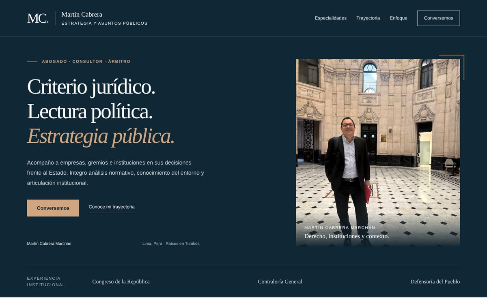
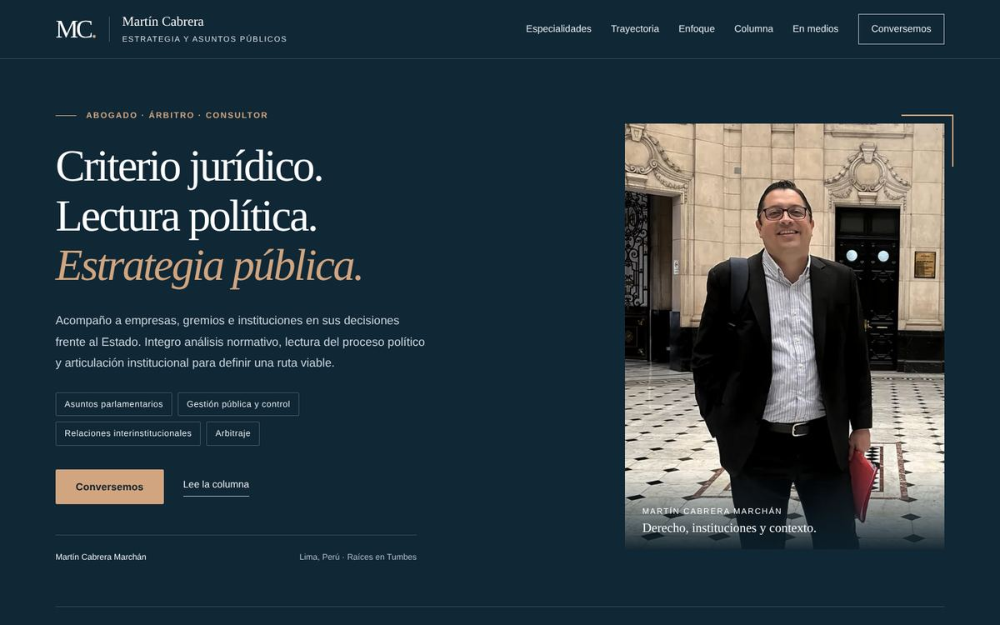
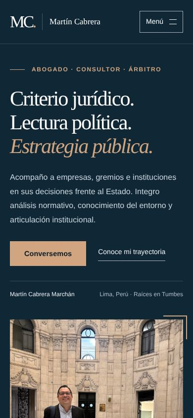
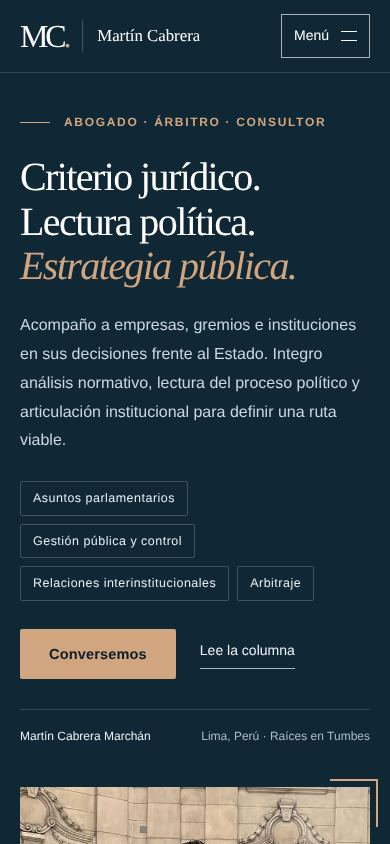

# Benchmark y propuesta de diseño

## Alcance y método

Se revisaron patrones de sitios personales y páginas de autor de referencia para profesionales que combinan práctica profesional y opinión pública. **Limitación:** desde el entorno de trabajo no fue posible abrir esos sitios en vivo (el proxy de red bloquea la navegación general), de modo que el análisis se basa en el conocimiento de su estructura conocida y no en una auditoría actual. Antes de copiar un detalle concreto, conviene volver a mirarlos.

## Referencias

| Referencia | Qué hace bien | Qué se tomó para este sitio |
| --- | --- | --- |
| **Stratechery** (Ben Thompson) | La columna es el producto: cadencia fija, archivo ordenado, suscripción visible. | Columna como sección propia con archivo, RSS y las tres entregas más recientes en portada. |
| **Paul Graham — Essays** | Texto primero, sin ruido; un índice simple de ensayos. | Archivo de columnas como lista sobria agrupada por año. |
| **Seth Godin — blog** | Publicación diaria y breve; el formato no castiga la frecuencia. | El sistema admite cadencia semanal o diaria con el mismo archivo `.md`. |
| **Craig Mod** | Tipografía editorial, márgenes amplios, medida de línea cómoda. | Páginas de columna con medida de ~68 caracteres, serif para lectura, capitular y cita destacada. |
| **Páginas de expertos de think tanks** (Brookings, CSIS, Wilson Center) | Biografía, áreas de especialidad, publicaciones y «en los medios» en una sola página. | Estructura: especialidades → trayectoria → enfoque → columna → en medios → contacto. |
| **Páginas de autor de diarios** (El País, The Atlantic) | Firma con foto, bajada, fecha y tiempo de lectura; bloque de autor al final. | Metadatos de columna (fecha, tiempo de lectura, etiquetas) y recuadro de autor con retrato. |
| **Perfiles de socios en firmas de abogados** | Áreas de práctica con alcance concreto, sin adjetivos. | Especialidades desplegables con entregables reales (ayudas memoria, cuadros comparativos, mapas de actores). |
| **Substack / Ghost** | Captación de suscriptores por correo. | **No se adoptó**: requiere un servicio externo. Se ofrece RSS; un boletín queda como decisión futura. |

## Decisiones de diseño

### Paleta (sin cambios de identidad, con roles definidos)

| Token | Valor | Uso |
| --- | --- | --- |
| `--navy` | `#102735` | Encabezado, portada, «En medios», pie. |
| `--navy-deep` | `#0b1e29` | Enfoque, menú móvil, fondo de videos. |
| `--white` / `--paper` | `#fff` / `#f5f7f8` | Secciones de lectura; trayectoria y formulario. |
| `--paper-warm` | `#f8f4ef` | Nuevo: fondo de la columna, enlaza el blanco con el cobre. |
| `--copper` | `#d1a580` | Acentos sobre azul (contraste 6,9:1). |
| `--copper-dark` | `#845638` | Texto y foco sobre fondos claros (6,2:1). |
| `--copper-light` | `#e6c5a8` | Nuevo: estado *hover* del botón cobre. |

El ritmo cromático de la página alterna azul y claro: azul (inicio) → blanco (especialidades) → gris (trayectoria) → azul oscuro (enfoque) → papel cálido (columna) → azul (medios) → blanco (contacto).

### Tipografía

Se mantiene Georgia para titulares y Arial/Helvetica para texto, sin descargar fuentes. La columna usa Georgia también en el cuerpo, a 1,16 rem con interlineado 1,8, para lectura larga.

### Fotografía

Se conserva tu fotografía real. Se creó un **recorte editorial 3:4** centrado en rostro y torso (en la versión anterior la figura ocupaba una parte pequeña del encuadre), con ajuste leve de contraste y saturación, en JPG y WebP con tamaños responsivos. También un avatar para la firma de las columnas y una imagen 1200×630 para compartir en redes. El original queda intacto en `assets/martin-cabrera.jpg`. No se generó ni alteró el rostro.

### Cambios por sección

1. **Encabezado fijo** con dos entradas nuevas: Columna y En medios.
2. **Inicio**: orden «Abogado · Árbitro · Consultor», etiquetas con las cuatro áreas, segunda franja «Opinión publicada en: El Comercio · Lampadia · Perú21 TV».
3. **Especialidades**: se añadieron entregables que forman parte de tu práctica (ayudas memoria de proyectos de ley, cuadros comparativos de textos normativos, correlación de fuerzas, planes de incidencia, comunicaciones formales ante autoridades).
4. **Trayectoria**: se añadieron ASEPRI y la condición de columnista en El Comercio, y una nota de que la mención de entidades no implica respaldo.
5. **Columna** (nueva): textos propios generados desde Markdown y lista de columnas publicadas en medios con enlace al original.
6. **En medios** (nueva): videos con carga diferida, declaraciones en prensa y enlaces a perfiles.
7. **Contacto**: validación accesible, contador de caracteres y texto que aclara que la página no envía ni almacena datos.

## Capturas

| Antes | Después |
| --- | --- |
|  |  |
|  |  |

Página completa: [antes](capturas/antes-pagina-completa.jpg) · [después](capturas/despues-pagina-completa.jpg) · [maqueta de una columna con texto de prueba](capturas/columna-plantilla.jpg).
